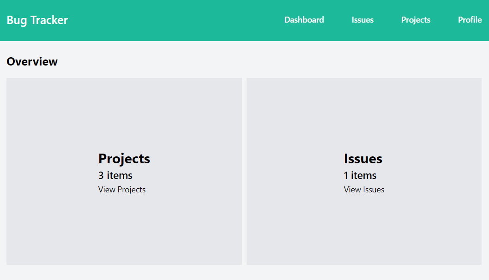
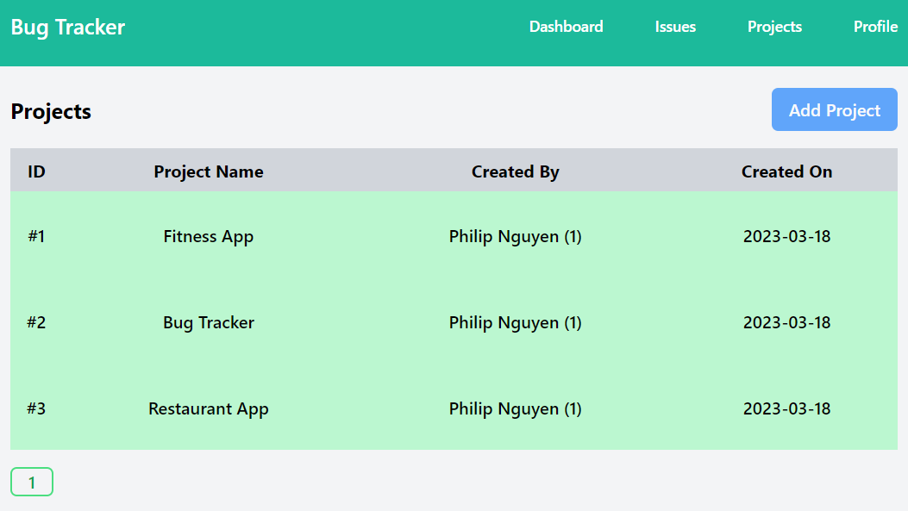
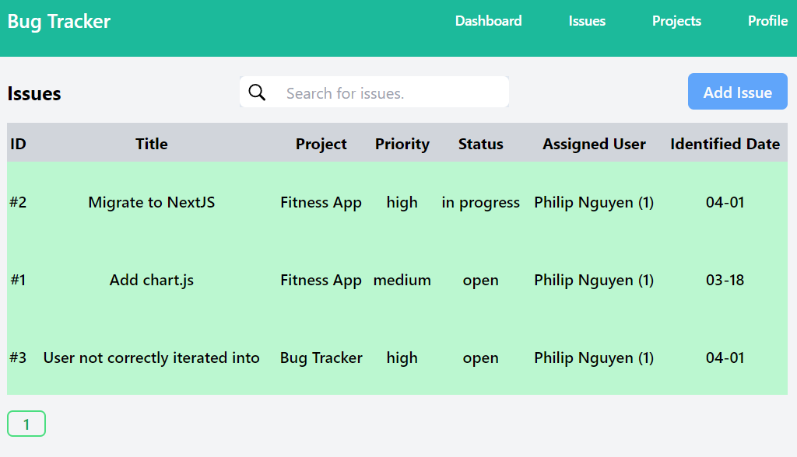
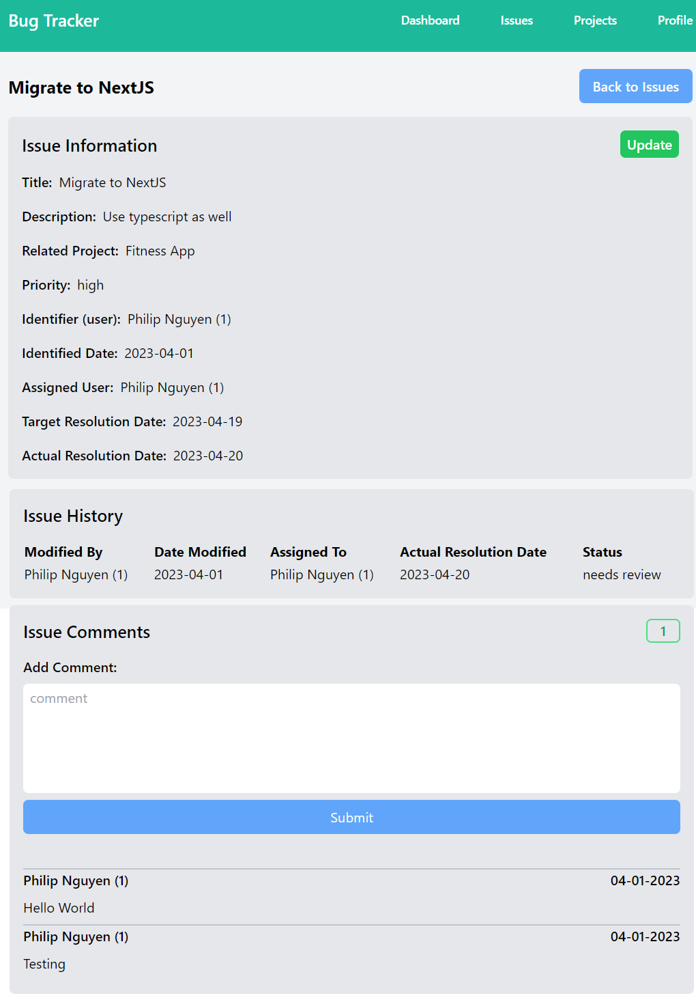
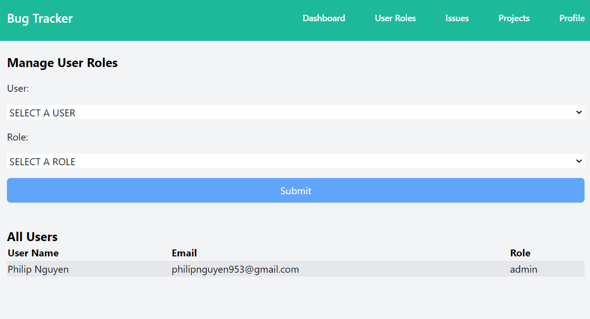

# bug-tracker

## Keep track of bugs for annihilation.

This NextJS project is used for keeping track of the bugs and progress made towards fixing them across several projects.

## Technologies Used:

- NextJS
- PostgresSQL
- TailwindCSS

## Functions:
- User Authentication and Authorization
- Dashboard
- Projects Management
- Issues Management / Tracking
- User Comments and Logs to Track Changes Across Issues
- User Roles Management Page (Admin Only)

## Preview:

### Home Page

### Projects Page

### Issues Page

### Issue Details Page

### User Roles Page
